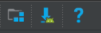
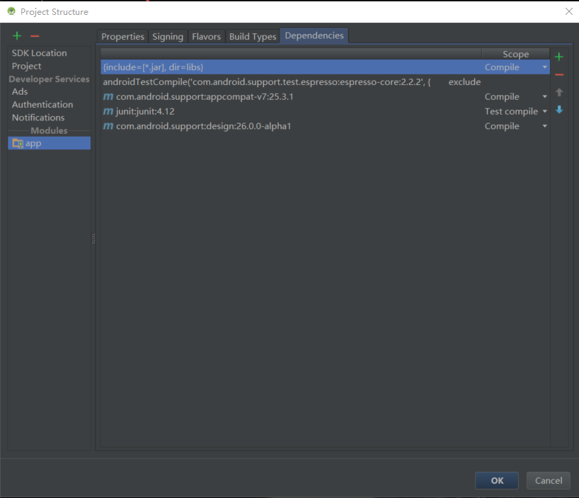
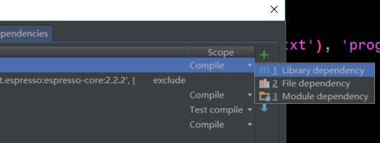
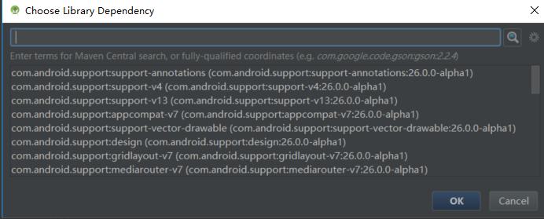

# FragmentBestPractice
簡易版的新聞應用


* 在使用到RecyclerView時，需要在app/build.gradle中添加依賴庫

* 書上的寫法是：

```gradle

  compile 'com.android.support:appcompat-v7:25.3.1'
    testCompile 'junit:junit:4.12'
    //noinspection GradleCompatible
    compile 'com.android.support:RecyclerView:-v7:24.2.1'

```

* 但是，原本有的依賴庫已經將這些全部放到design裡面了，所以，最好的寫法是：

```gradle

  compile 'com.android.support:appcompat-v7:25.3.1'
    testCompile 'junit:junit:4.12'
    //noinspection GradleCompatible
    compile 'com.android.support:design:26.0.0-alpha1'

```

* 在AS中，有提供著很多種自帶的依賴庫，可以調用這些依賴庫中的依賴，進行更加簡化的操作

* 在AS最上方有這樣的圖標，最右邊的是ProjectStructure，用來查看有哪些依賴的



* 點擊進去之後，可以看到：



* 點擊最右邊的加號可以看到：



* 之後是：



## 通過以上的步驟可以看到Google官方提供的依賴，并進行使用
